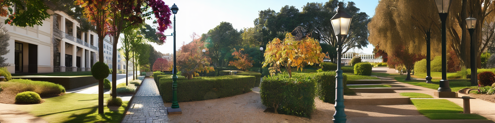
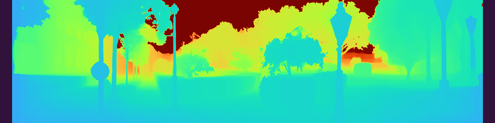

# PanoDreamer

> PanoDreamer: Optimization-Based Single Image to 360° 3D Scene With Diffusion  
> [Avinash Paliwal](http://avinashpaliwal.com/),
> [Xilong Zhou](https://xilongzhou.github.io/), 
> [Andrii Tsarov](https://www.linkedin.com/in/andrii-tsarov-b8a9bb13), 
> [Nima Khademi Kalantari](http://nkhademi.com/)

[](https://arxiv.org/abs/2412.04827)
[](https://dl.acm.org/doi/full/10.1145/3757377.3763883)
[](https://people.engr.tamu.edu/nimak/Papers/PanoDreamer/index.html)
[](https://youtu.be/EyVfFCg4aF8)

<p align="center">
  <a href="">
    
  </a>
</p>

## Overview

This repository implements panorama generation and 3D scene creation:

- **`multicondiffusion.py`**: Extends an image horizontally in perspective space
- **`multicondiffusion_panorama.py`**: Generates a 360° cylindrical panorama
- **`depth_estimation.py`**: Estimates consistent depth maps for wide/panoramic images
- **`ldi_generation.py`**: Creates Layered Depth Images with background inpainting
- **`train_gsplat.py`**: Optimizes 3DGS scene from panorama LDI
- **`render_gsplat.py`**: Renders 3DGS scenes using gsplat (for visualization)

### Implementation Status

- [x] MultiConDiffusion (wide image generation)
- [x] Cylindrical panorama generation (360°)
- [x] Depth estimation
- [x] LDI generation (layered depth images)
- [x] 3DGS scene optimization (training from LDI)
- [x] 3DGS rendering (visualization with gsplat)

## Example

<p align="center">
  
  <br>
  <em>Wide image generated with MultiConDiffusion</em>
</p>

<p align="center">
  
  <br>
  <em>Depth estimation with view stitching (bug needs to be fixed)</em>
</p>

## Setup

```bash
# Clone repository with submodules
git clone --recursive https://github.com/yourusername/panodreamer.git
cd panodreamer

# Or if already cloned, initialize submodules
git submodule update --init --recursive

# Create environment
uv venv
source .venv/bin/activate
uv pip install -e .

# Clone Depth Anything V2 (for depth estimation)
git clone https://github.com/DepthAnything/Depth-Anything-V2.git

# Download depth model checkpoint
# mkdir -p checkpoints
# wget -P checkpoints https://huggingface.co/depth-anything/Depth-Anything-V2-Large/resolve/main/depth_anything_v2_vitl.pth

# Download inpainting checkpoints for LDI generation
# The original 3d-moments download.sh has broken links
# Use our download script to get checkpoints from Google Drive
pip install gdown
python download_inpainting_ckpts.py
```

## Usage

### 1. Wide Image Generation
Extends the input image horizontally in perspective space.
```bash
python multicondiffusion.py \
  --prompt_file examples/29_real_campus_3.txt \
  --input_image examples/29_real_campus_3.png \
  --output_dir output
```

### 2. Cylindrical Panorama (360°)
Generates a full 360° cylindrical panorama from the input image.
```bash
python multicondiffusion_panorama.py \
  --prompt_file examples/29_real_campus_3.txt \
  --input_image examples/29_real_campus_3.png \
  --output_dir output
```

### 3. Depth Estimation
Estimates depth for wide images or cylindrical panoramas.
```bash
# For wide images (perspective)
python depth_estimation.py \
  --input_image output/final_output.png \
  --output_dir output_depth \
  --mode wide

# For 360° panoramas (cylindrical)
python depth_estimation.py \
  --input_image output/final_output.png \
  --output_dir output_depth \
  --mode panorama
```

### 4. LDI Generation
Creates layered depth images by splitting depth into layers and inpainting occluded backgrounds.
```bash
python ldi_generation.py \
  --input_image output/final_output.png \
  --input_depth output_depth/depth.npy \
  --output_dir output_ldi \
  --num_layers 4
```

### 5. 3DGS Scene Optimization
Optimizes a 3D Gaussian Splatting scene from panorama LDI layers.
```bash
python train_gsplat.py \
  --ldi_dir output_ldi \
  --output scene_optimized.ply \
  --num_iterations 300 \
  --num_views 16
```

### 6. 3DGS Rendering
Renders 3D Gaussian Splatting scenes using gsplat (for visualization).
```bash
python render_gsplat.py \
  --ply scene_optimized.ply \
  --output renders \
  --num_frames 720 \
  --radius 2.0
```

### Arguments

**Panorama generation** (`multicondiffusion.py`, `multicondiffusion_panorama.py`):
- `--prompt_file`: Text file with scene description
- `--input_image`: Input image (placed in center)
- `--steps`: Denoising steps per iteration (default: 50)
- `--iterations`: Number of refinement iterations (default: 15)
- `--H`, `--W`: Output dimensions (default: 512x2048)
- `--guidance`: Guidance scale (default: 7.5)
- `--seed`: Random seed (default: 0)
- `--debug`: Save debug visualizations

**Depth estimation** (`depth_estimation.py`):
- `--input_image`: Input wide/panoramic image
- `--output_dir`: Output directory
- `--mode`: `wide` for perspective images, `panorama` for 360° cylindrical
- `--iterations`: Number of alignment iterations (default: 15)
- `--debug`: Save intermediate depth info

**LDI generation** (`ldi_generation.py`):
- `--input_image`: Input panorama image
- `--input_depth`: Depth map (.npy file)
- `--output_dir`: Output directory
- `--num_layers`: Number of depth layers (default: 4)
- `--debug`: Save layer visualizations

**3DGS training** (`train_gsplat.py`):
- `--ldi_dir`: Path to panorama LDI directory
- `--output`: Output PLY file path (default: scene_optimized.ply)
- `--num_iterations`: Number of optimization iterations (default: 300)
- `--num_views`: Number of training views (default: 16)
- `--lr`: Learning rate (default: 0.001)
- `--focal`: Focal length (default: 582.69)
- `--radius`: Camera orbit radius (default: 4.0)

**3DGS rendering** (`render_gsplat.py`):
- `--ply`: Path to 3DGS PLY file
- `--output`: Output directory
- `--num_frames`: Number of frames (default: 120)
- `--fps`: Video frame rate (default: 60)
- `--radius`: Camera orbit radius (default: 4.0)
- `--focal`: Focal length (default: 582.69)

## Acknowledgements

This codebase builds upon several excellent open-source projects:

- **[MultiDiffusion](https://github.com/omerbt/MultiDiffusion)** - Fusing diffusion paths for controlled image generation
- **[LucidDreamer](https://github.com/EnVision-Research/LucidDreamer)** - Domain-free generation of 3D Gaussian Splatting scenes
- **[3d-moments](https://github.com/google-research/3d-moments)** - Inpainting networks for layered depth images
- **[Depth-Anything-V2](https://github.com/DepthAnything/Depth-Anything-V2)** - Monocular depth estimation
- **[gsplat](https://github.com/nerfstudio-project/gsplat)** - Python library for 3D Gaussian Splatting

We thank the authors for making their code publicly available.

## Citation

```bibtex
@inproceedings{paliwal2024panodreamer,
    author = {Paliwal, Avinash and Zhou, Xilong and Tsarov, Andrii and Kalantari, Nima},
    title = {PanoDreamer: Optimization-Based Single Image to 360° 3D Scene With Diffusion},
    year = {2025},
    booktitle = {Proceedings of the SIGGRAPH Asia 2025 Conference Papers},
    articleno = {112},
    numpages = {10},
    doi = {10.1145/3757377.3763883},
    url = {https://doi.org/10.1145/3757377.3763883}
}
```
